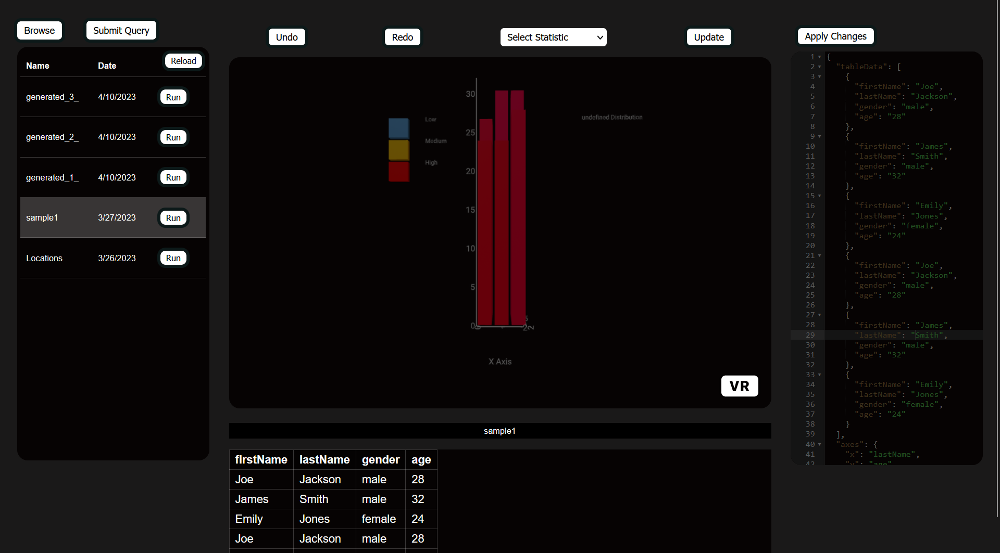

# Immersive Data Visualisation Application

This repository contains the source code for an Immersive WebVR Data Visualisation application that enables users to interact with complex data sets in an immersive 3D environment using Oculus Rift HMD and Oculus Touch controllers.

## Table of Contents

- [Features](#features)
- [Requirements](#requirements)
- [Installation](#installation)
- [Usage](#usage)
- [Contributing](#contributing)
- [License](#license)

## Features

- Immersive 3D environment for data visualisation
- Oculus Rift HMD and Oculus Touch controller support
- Built using A-Frame, D3.js, and JavaScript
- Modular application architecture for compatibility across devices and platforms
- Intuitive user interface with seamless navigation and interaction
- Real-time data processing and visualisation capabilities
- Customizable visualisations and interactions

## Requirements

- A modern web browser with WebVR support (e.g., Mozilla Firefox, Google Chrome)
- Oculus Rift HMD and Oculus Touch controllers

## Installation

1. Clone the repository to your local machine: git clone https://github.com/OgbondaGlory/Immersive-Data-Vis-VR.git
2. Navigate to the project directory: cd Immersive-Data-Vis-VR
3. Install the required dependencies: npm install
4. Start the development server: npm start

5. Open your web browser and navigate to `http://localhost:3000`.

## Usage

1. Put on your Oculus Rift HMD and ensure your Oculus Touch controllers are powered on and connected.
2. Navigate through the application using the Oculus Touch controllers to interact with the visualisations.
3. Customize visualisations and interactions as desired by modifying the application source code.

## Contributing

Contributions are welcome! Please read the [contributing guidelines](CONTRIBUTING.md) to get started.

## License

This project is licensed under the [MIT License](LICENSE.md).

